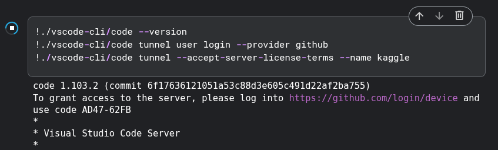
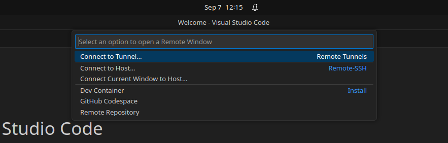
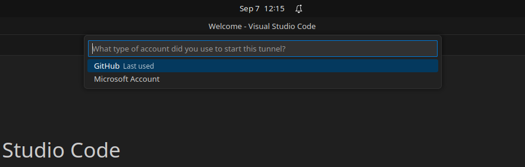
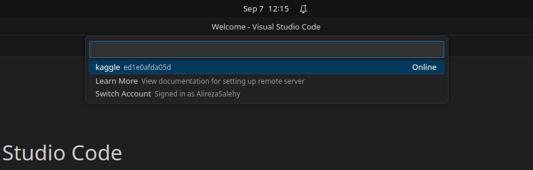
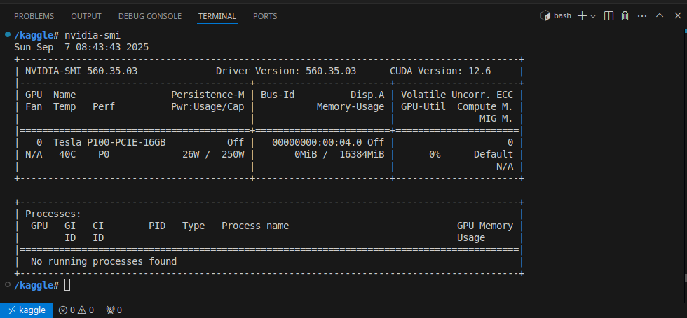

# VS Code Remote Tunnels on Kaggle
This approach sits alongside the SSH method in [hoang-quoc-trung/remote-ssh-kaggle-vscode](https://github.com/hoang-quoc-trung/remote-ssh-kaggle-vscode). SSH works well when you can manage keys and open ports, but it can be fiddly on locked-down environments and often pushes you toward extra tooling. **Remote Tunnels** instead dials out from Kaggle, so there’s no inbound access to arrange and none of the usual ngrok-style headaches (ephemeral URLs, quotas, extra daemons, or port wrangling).

**What this notebook does.** It starts a lightweight VS Code server inside the running Kaggle session so you can edit, run, and debug from VS Code Desktop. You can find the setup for kaggle in [KaggleVSTunnel notebook](https://www.kaggle.com/code/alirezasalehy/kagglevstunnel/edit) (It should be the same for Google Colab). The first cell (“bootstrap”) downloads the CLI into a folder under the working directory and extracts it. The second cell (“tunnel”) verifies the CLI, prompts a one-time device login with GitHub or Microsoft, and brings up a named tunnel you connect to from your editor. Keep the tunnel cell running; stopping it closes the connection.

**Setup on Kaggle.** Enable Internet for the notebook, run the bootstrap cell once per clean environment (when the CLI isn’t downloaded), then run the tunnel cell every session; it will prompt you to sign in—complete the device login in your browser and return to the notebook. If the version check in the tunnel cell fails, simply re-run the bootstrap cell first. Sessions are ephemeral; if your `/kaggle/working` is persisted and the CLI remains there, you can skip the bootstrap on later sessions.

When you start the tunnel in the notebook, it prints a device-login URL and code—open the link, enter the code, and approve.  

**Connect from VS Code.** In VS Code Desktop, install **Remote – Tunnels**, open the Remote menu (status bar, lower-left) or the Command Palette, choose **Connect to Tunnel…**, select the same account provider you used to start the tunnel in notebook, and pick the tunnel name shown by the notebook. Accept the trust prompt and open `/kaggle/working` so you’re editing the same files the notebook uses.

1. Open the Remote menu and choose **Connect to Tunnel…**  
   

2. Pick the account provider used to start the tunnel (GitHub or Microsoft).  
   

3. Select the tunnel (e.g., **kaggle**).  
   

5. Once connected, the integrated terminal runs on Kaggle (And you can check with executing nvidia-smi).  
   

